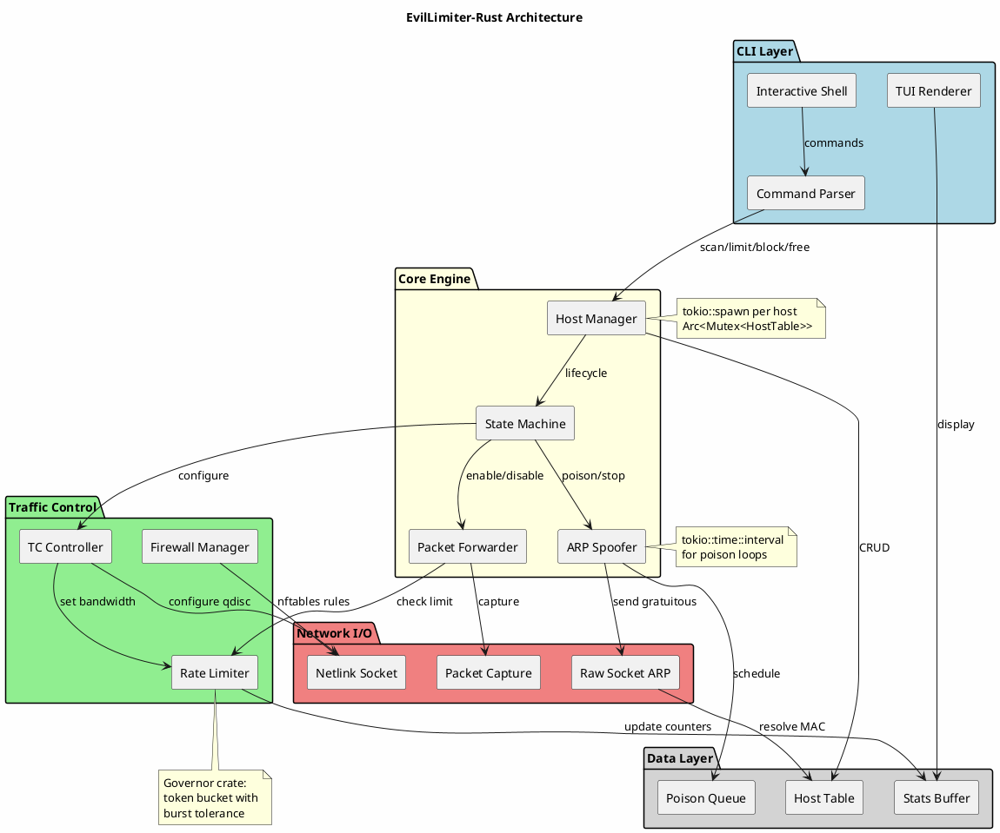

# Implementation Roadmap

### Phase 1: Core Infrastructure (Weeks 1-2)

| Milestone | Components | Key Crates |
|-----------|-----------|------------|
| **Network Discovery** | ARP scanning, host table management | `pnet`, `tokio`, `serde` |
| **Packet Crafting** | Safe ARP/IPv4/Ethernet frame construction | `pnet`, `zerocopy` |
| **Async Runtime** | Multi-victim concurrency, poison scheduling | `tokio`, `tokio-util` |

### Phase 2: MITM Engine (Weeks 3-4)

| Milestone | Components | Key Crates |
|-----------|-----------|------------|
| **ARP Spoofer** | Bidirectional poison loops, cache management | `pnet`, `tokio::sync` |
| **Packet Forwarder** | Zero-copy forwarding, NAT handling | `tokio::net`, `nix` |
| **State Machine** | Host lifecycle (idle → poisoning → limiting → blocked) | `rust-fsm` |

### Phase 3: Traffic Control (Weeks 5-6)

| Milestone | Components | Key Crates |
|-----------|-----------|------------|
| **TC Integration** | Netlink socket communication, HTB qdiscs | `rtnetlink`, `netlink-sys` |
| **Rate Limiting** | Token bucket algorithm, burst handling | `governor`, `nonzero_ext` |
| **Firewall Rules** | nftables programmatic management | `nftables-rs` |

### Phase 4: TUI & Monitoring (Weeks 7-8)

| Milestone | Components | Key Crates |
|-----------|-----------|------------|
| **Interactive Shell** | Command parsing, real-time status | `ratatui` |
| **Bandwidth Monitor** | Per-host statistics, live graphs | `tokio::time`, `crossterm` |
| **Watch System** | IP change detection, auto-reconnect | `tokio::sync::watch` |

### Phase 5: Hardening (Week 9-10)

| Milestone | Components |
|-----------|-----------|
| **Error Recovery** | Poison failure detection, automatic retry with backoff |
| **Stealth Modes** | Slow-poison (evade ARP inspection), randomization |
| **IPv6 Support** | NDP spoofing implementation (bonus) |

---

## PlantUML Architecture Diagram



---

## Detailed Component Specifications

### 1. Host Manager (`host/manager.rs`)

```rust
pub struct HostManager {
    table: Arc<RwLock<HostTable>>,
    event_tx: mpsc::Sender<HostEvent>,
}

pub enum HostState {
    Idle,
    Poisoning { handle: PoisonHandle },
    Limited { upload: RateLimit, download: RateLimit },
    Blocked,
}

// Memory safety: HostTable uses DashMap for lock-free reads
// during high-frequency ARP operations
```

### 2. ARP Spoofer (`network/arp.rs`)

```rust
pub struct ArpSpoofer {
    socket: Arc<AsyncRawSocket>,
    poison_interval: Duration,
}

impl ArpSpoofer {
    // Safety: Packet construction uses pnet's immutable buffers
    // No manual pointer arithmetic
    pub async fn poison(&self, target: Host, gateway: Host) -> Result<()> {
        let packet = ArpPacket::new_gratuitous(
            target.ip, gateway.ip, 
            self.mac // Our MAC claiming gateway's IP
        )?;
        self.socket.send_to(packet, target.mac).await
    }
}
```

### 3. Traffic Controller (`tc/controller.rs`)

```rust
pub struct TcController {
    handle: rtnetlink::Handle,
    interface: String,
}

impl TcController {
    // Creates HTB hierarchy:
    // root → 1: → 1:1 (gateway) → 1:10 (victim 1) → 1:100 (upload) / 1:101 (download)
    pub async fn limit_host(&self, host: &Host, rate: BitRate) -> Result<()> {
        self.add_htb_class(host, rate).await?;
        self.add_filter(host).await // Match src/dst IP to class
    }
}
```

### 4. Rate Limiter (`shaping/governor.rs`)

```rust
use governor::{Quota, RateLimiter};
use nonzero_ext::nonzero;

pub struct BandwidthLimiter {
    limiter: RateLimiter<IpAddr, DashMapStateStore<IpAddr>, DefaultClock>,
}

// Per-host token buckets with burst capacity
// Non-blocking check: if no tokens, packet is queued/dropped at TC layer
```

---

## Key Safety Guarantees (Rust vs Python)

| Aspect | Python (Original) | Rust (This Design) |
|--------|-------------------|-------------------|
| **Packet Parsing** | Runtime bounds checking (scapy) | Compile-time ownership + `zerocopy` |
| **Concurrent Hosts** | GIL contention, race conditions on shared state | `tokio::sync` + `DashMap` lock-free |
| **Memory Leaks** | Possible in long-running processes | RAII, no leaks possible |
| **ARP State** | Dictionary mutations during iteration | `HostState` enum + `match` exhaustiveness |
| **Resource Cleanup** | `__del__` unreliable | `Drop` trait guarantees tc/nftables cleanup |

